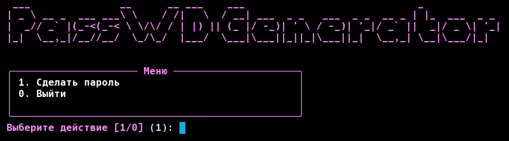

# PassWDGenerator



## Архитектура

### Структура проекта
```
password_generation/
├── main.py                 # Основной файл приложения
├── requirements.txt        # Зависимости проекта
├── pyproject.toml          # Конфигурация проекта
├── run_password_gen.bat    # Скрипт запуска для Windows
├── run_password_gen.sh     # Скрипт запуска для Unix-систем
└── ...
```

## API и интерфейсы

### Основные функции

#### `generate_password(length: int = 16, character_set: str = None) -> str`
Генерирует случайный пароль заданной длины.

**Параметры:**
- `length` (int, по умолчанию 16): Длина пароля
- `character_set` (str, по умолчанию None): Набор символов для генерации


### CLI команды

#### `generate`
Генерирует пароли с настраиваемыми параметрами.

**Параметры:**
- `--length` или `-l` (int, по умолчанию 16): Длина пароля (4-128)
- `--count` или `-c` (int, по умолчанию 1): Количество паролей (1-10)
- `--include-digits` или `--no-digits` (bool): Включать цифры
- `--include-punct` или `--no-punct` (bool): Включать знаки препинания
- `--exclude-ambiguous` или `--include-ambiguous` (bool): Исключить неоднозначные символы

**Примеры:**
```bash
# Генерация одного пароля длиной 16 символов
python main.py generate

# Генерация 5 паролей длиной 20 символов без цифр
python main.py generate --length 20 --count 5 --no-digits
```

## Установка и запуск

### Системные требования
- Python 3.7+
- pip 

### Установка зависимостей
```bash
pip install -r requirements.txt
```

Альтернативно:
```bash
pip install -e .
```

### Запуск приложения

#### Интерактивный режим
```bash
python main.py
```

#### CLI команды
```bash
python main.py generate --length 16 --count 1
```

### Установка как системной команды
После установки через `pip install -e .` доступна команда:
```bash
password-gen generate --length 16
```

## Примеры использования

### Простая генерация пароля
```bash
python main.py generate
```

### Генерация нескольких паролей
```bash
python main.py generate --count 5
```

### Настройка параметров
```bash
# Пароль длиной 20 символов без цифр
python main.py generate --length 20 --no-digits

# 3 пароля с исключением неоднозначных символов
python main.py generate --length 16 --count 3 --exclude-ambiguous
```

### Использование в скриптах
```bash
#!/bin/bash
# Генерация и сохранение пароля в переменную
PASSWORD=$(python main.py generate --length 16 | grep -o '[A-Za-z0-9!@#$%^&*()_+]*')
echo "Сгенерированный пароль: $PASSWORD"
```